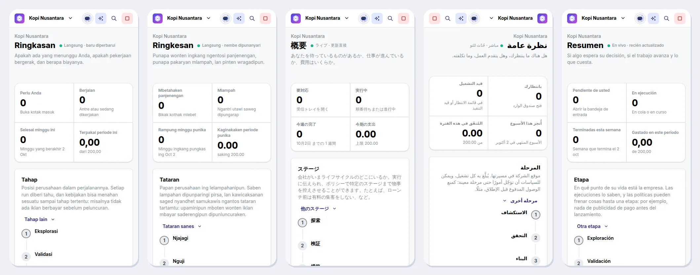
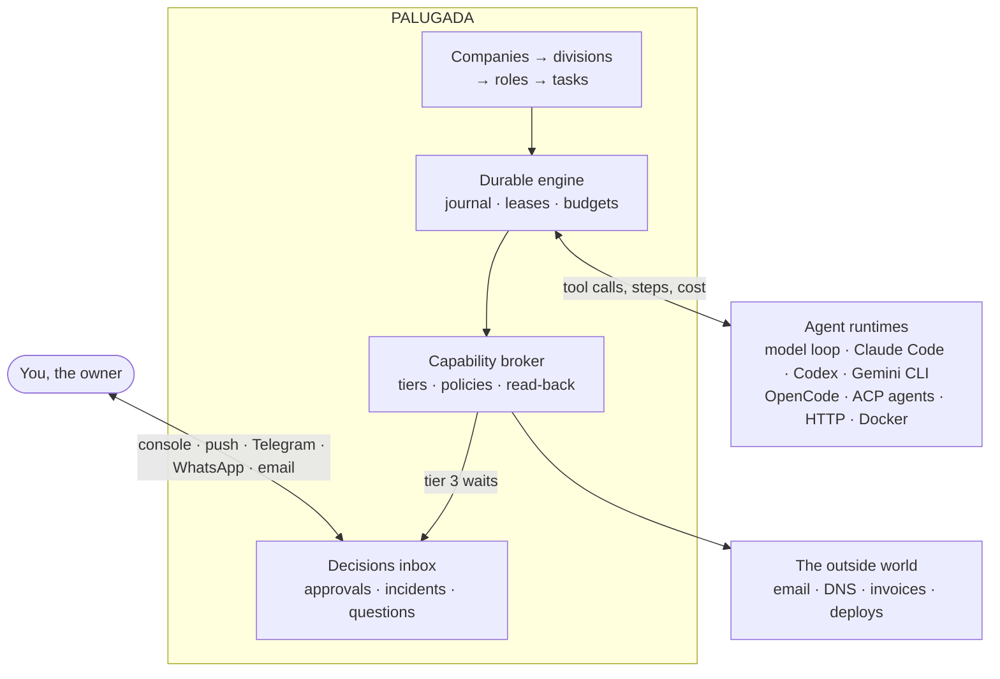

<p align="center">
  <picture>
    <source media="(prefers-color-scheme: dark)" srcset="brand/banners/palugada-banner-dark.png">
    
  </picture>
</p>

<h3 align="center">Agents do the work. You decide only what cannot be undone.</h3>

<p align="center">
  <a href="#quickstart"><b>Quickstart</b></a> ·
  <a href="#how-it-works"><b>How it works</b></a> ·
  <a href="docs/guide/README.md"><b>Guide</b></a> ·
  <a href="docs/features.md"><b>Features</b></a> ·
  <a href="#faq"><b>FAQ</b></a> ·
  <a href="docs/STATUS.md"><b>Status</b></a> ·
  <a href="CONTRIBUTING.md"><b>Contributing</b></a>
</p>

<p align="center">
  <a href="https://github.com/TegarTheGreat/PALUGADA/actions/workflows/ci.yml"></a>
  
  
  
  
  
</p>

<p align="center">
  
</p>

**PALUGADA** is a self-hosted control plane for companies run by AI agents.
Agents plan, build, market, answer customers and keep the books. You own the
company, and your whole job is one inbox of decisions -- in the console, on
your phone, or as a button in Telegram or WhatsApp. Nothing irreversible
happens until you say so, and money is reserved before any work starts.

Most tools for agents ask you to watch them work. PALUGADA asks you only to
decide. One installation runs as many companies as you like, each isolated by
the database itself.

| | Step | What happens |
|---|---|---|
| **01** | **Start a company** | From a template: eight divisions by function, a role in each with a charter and done criteria, a budget for every division, a goal ladder, and a CEO you talk to. |
| **02** | **Give it work** | Tell the CEO what you want. The work goes to the role whose job it is, on the model or agent you chose for it, through a broker that knows what each action costs and how hard it is to undo. |
| **03** | **Decide what matters** | Reading and undoable work simply happens. Spending needs a plan and a budget. Anything irreversible waits for you, with a second factor. |

> *Palugada* is Jakarta slang: *apa lu mau, gua ada* -- whatever you need,
> it's here.

## Is PALUGADA for you?

- ✅ You want **companies that run on their own**, and you want to be asked before anything that cannot be taken back.
- ✅ You run **several businesses or brands** and want one inbox for all of them.
- ✅ You want agents to **spend money safely**: reserved before the work, capped per task and per month, paused at the ceiling.
- ✅ You want to **bring your own agents and models** -- Claude Code, Codex, Gemini CLI, a local model -- rather than be locked to one.
- ✅ You want to **decide from your phone**, in your own language.
- ✅ You want it **on your own server**, with your data in your own PostgreSQL.

It is **not** for you if you need many people working in it (there is one owner, by design), a chat workspace where agents talk in threads, a framework for building agents, or a boxes-and-arrows workflow builder. And it is not an autopilot without brakes: what cannot be undone always waits for a person. That is the design, not a setting.

## Quickstart

**In one command**, with nothing on the machine but Docker:

```sh
curl -fsSL https://raw.githubusercontent.com/TegarTheGreat/PALUGADA/main/install.sh | sh
```

It fetches PALUGADA into `~/palugada`, writes the database's passwords to
its `.env`, starts it with Docker Compose, waits until the console answers,
and prints a link: whoever opens it first becomes the owner, adds PALUGADA to
their authenticator app there, and chooses the model in the console. Run the
same command again to update; the passwords and the data stay, and the
database is copied to `~/palugada/backups` first.

**With Docker, step by step** (Docker Compose, and Node 22.18+ for the setup):

```sh
git clone https://github.com/TegarTheGreat/PALUGADA.git && cd PALUGADA
npm install
npm run setup                  # choose "With Docker Compose"
docker compose up -d --build
```

Then open **http://127.0.0.1:8787**, sign in with the six-digit code from your
authenticator app, and press **Start a company**.

`npm run setup` asks three things and writes them to `.env`: where PALUGADA
runs, your authenticator (it shows a QR code and checks a code from your
phone), and which model does the work. Setup sends the model one request to
prove the key, the address, and that it calls tools.

<details>
<summary><b>On this machine</b>, with Node 22.18+ and PostgreSQL 16 with pgvector</summary>

```sh
git clone https://github.com/TegarTheGreat/PALUGADA.git && cd PALUGADA
npm install && npm run console:install
npm run setup                  # choose "On this machine"
npm run db:setup && npm run db:migrate   # once; pgvector needs a Postgres superuser
npm run console:build
npm start
```

[pgvector](https://github.com/pgvector/pgvector) must be installed in your
PostgreSQL; `deploy/palugada.service` runs it under systemd.
</details>

<details>
<summary><b>On Coolify or Dokploy</b></summary>

Point a Docker Compose application at this repository with
`deploy/coolify/docker-compose.yml` or `deploy/dokploy/docker-compose.yml`,
give the `app` service a domain, and deploy. The image sets its database up,
and its log prints a link that makes you the owner
([the walk-through](docs/guide/coolify-dokploy.md)).
</details>

New here? [The guide](docs/guide/README.md) walks through the first hour,
what each screen is for, and how to run it for real at each size. Every
setting is in [docs/configuration.md](docs/configuration.md).

## How it works

Every action an agent takes goes through a capability broker that knows its
tier: what it costs and how hard it is to undo.

| Tier | Effect | For example | What happens |
|---|---|---|---|
| 0 | Reads | a DNS lookup, an uptime check | Runs |
| 1 | Cheap to undo | a draft, a staging deploy | Runs, then is read back to verify it |
| 2 | Costs money or reaches people | an email to a customer, an invoice paid | Needs a plan and a budget check first, verified after |
| 3 | Irreversible | nameservers, deletions, transfers, signatures | Waits for you, in the app, with a second factor |

No template, policy, bundle or agent can move a tier 3 action out of your
hands, and a request you never answer cancels itself: silence never executes
anything.

<table>
  <tr>
    <td width="33%" valign="top"><b>📥 One inbox</b><br>Every decision from every company in one queue: the goal it serves, what it costs, how reversible it is and what happens if you say no. Searchable afterwards.</td>
    <td width="33%" valign="top"><b>🔐 The irreversible waits for you</b><br>A second factor -- an authenticator code or a passkey -- for tier 3, approvals that expire into a cancellation, and one approval for exactly one action.</td>
    <td width="33%" valign="top"><b>💸 Money cannot run away</b><br>Reserved before work starts, a ceiling per task, per division and per month, a warning at 80%, a pause at 100% and a breaker on the burn rate.</td>
  </tr>
  <tr>
    <td valign="top"><b>🏢 An organisation that moves</b><br>A CEO you talk to, roles that hand work to each other, a stuck division that asks the CEO before it asks you, and a weekly strategist if you let the company run itself.</td>
    <td valign="top"><b>🤖 Any model, or your agent</b><br>The platform's own loop on any model, or a role on Claude Code, Codex, Gemini CLI, OpenCode and others. None sees a credential or the database, and each gets only the tools it was granted.</td>
    <td valign="top"><b>♻️ A crash loses little</b><br>Every step is journalled and a run resumes at the step it reached. Leases stop a task running twice, and a task that keeps killing its worker is halted.</td>
  </tr>
  <tr>
    <td valign="top"><b>🛡️ Isolation in the database</b><br>Row-level security forced on every tenant table, and references that carry the company: a row cannot even point into another company.</td>
    <td valign="top"><b>🧠 A company that learns</b><br>Versioned facts, procedures distilled from experience, skills with eval cases, documents searched by meaning, and your word first in every run.</td>
    <td valign="top"><b>🌏 In your language</b><br>The console, and everything sent to your phone, in 21 languages; each company, and each project, chooses what its agents write in, and a slip into another language is caught.</td>
  </tr>
</table>

Everything else -- goals measured by numbers, stage gates, schedules, signed
webhooks, bundles, audit export -- is in [docs/features.md](docs/features.md).

## Works with

| | |
|---|---|
| **Agents** | The platform's own model loop · Claude Code · Codex · Gemini CLI · OpenCode · OpenClaw · Hermes · any [Agent Client Protocol](https://agentclientprotocol.com) agent · an HTTP service · Docker with no network |
| **Models** | Anthropic · OpenAI · OpenRouter · Gemini · DeepSeek · Groq · Ollama and vLLM on your own machine -- any OpenAI-compatible API whose models call tools |
| **Your phone** | The console, installable as an app · Telegram and WhatsApp, with buttons that decide · email through Resend, Postmark or SendGrid · urgent alerts through ntfy or a push webhook · Slack and Discord |
| **Tools** | MCP servers, signed in with OAuth · Composio, Pipedream, Arcade, Smithery and Zapier by name · vendor files for any HTTP API · web search, a browser, image generation and speech from the providers you choose |
| **Events in** | Signed webhooks from GitHub, Stripe, Slack and anything that speaks Standard Webhooks |
| **Runs on** | Docker Compose · Coolify · Dokploy · Node 22 and PostgreSQL 16 under systemd |

## See it

<table>
  <tr>
    <td width="50%"></td>
    <td width="50%"></td>
  </tr>
  <tr>
    <td></td>
    <td></td>
  </tr>
</table>

<p align="center">
  <br>
  <sub>The same company on a phone in Indonesian, Javanese, Japanese, Arabic (right to left) and Spanish.</sub>
</p>

## How it compares

PALUGADA was read against the systems people use to run agents at work --
chat workspaces, auto-company and Paperclip -- looking for what goes wrong in
each and whether it goes wrong here. The short version: an irreversible
action waits for the owner with a second factor rather than for a timeout,
money is reserved before the work rather than counted after it, and
companies are separated by the database rather than by application code.

<details>
<summary><b>The full comparison, with its sources</b></summary>

| | Chat workspaces (Slack, Buzz) | auto-company | Paperclip | **PALUGADA** |
|---|---|---|---|---|
| **An irreversible action** | Buzz approves every tool permission itself | "Do not wait for human approval" | Decisions expire after a week; no second factor | The owner, with a second factor; unanswered means cancelled |
| **Isolation between companies** | Buzz: row-level security specified, not shipped | — | Application code only | Forced row-level security, company-scoped foreign keys |
| **A spending ceiling** | — | — | Checked after the money is spent, so the call that crosses it runs | Reserved before the work starts, and each capability's estimate charged before it runs; one call costing more than its estimate can still pass it |
| **Usage an agent did not price** | — | Paused as "unverifiable" | Recorded at 0¢, so the hard stop never trips | Priced from the operator's list or a high fallback |
| **Agents triggering agents** | Buzz: no hop limit | — | A re-wake throttle, no hop limit | Hop limit and cycle detection |
| **Past decisions** | Lost as threads scroll | A file the model rewrites each cycle | Kept with the decider's note | Kept with the outcome and your note, and searchable |
| **Integrations** | Slack: a large app directory | — | A governed MCP gateway | Built-ins, vendor files, MCP servers signed in with OAuth, and Composio, Pipedream, Arcade, Smithery and Zapier by name; every tool still at a tier |
| **Watching it run** | — | — | Tracing | JSON logs, a health check, Prometheus metrics and OpenTelemetry traces |
| **Installing** | Slack: nothing, it is hosted; Buzz: a container image | A script | A container image | `npm run setup`, then Docker Compose or Node and Postgres; Linux only |
| **People** | Many | One | Many | One owner, by design |

The ceiling row is cited to Paperclip's `server/src/services/budgets.ts`
in [docs/COMPETITIVE-ANALYSIS-2026-09-30.md](docs/COMPETITIVE-ANALYSIS-2026-09-30.md),
which also found the same among newer projects: AgenticOS says in its own
documentation that runs going at once can pass its ceiling, and OtoDock
checks spending already recorded with nothing reserved. The next five rows
are cited to source code or public documentation in
[docs/RESEARCH-2026-09.md](docs/RESEARCH-2026-09.md); the last four, and the
corrections to the Paperclip column, come from the audit recorded in
[docs/STATUS.md](docs/STATUS.md) section 2.21, brought up to date as the
integrations and observability were built.
</details>

## Architecture



TypeScript on Node 22 with no build step for the server, PostgreSQL 16 with
pgvector, and a React and [Mantine](https://mantine.dev) console served from
the same origin under a strict content security policy. The engine never
calls a model itself: a runtime does -- the platform's own in-process loop,
or an agent you bring -- and the engine lends it tool calls through the
broker, journalled steps, contained sub-tasks and a way to report cost.

## FAQ

<details>
<summary><b>Is it ready for production?</b></summary>

It is version 0.1.0 and not yet released. Every requirement in the
specification is graded in [docs/STATUS.md](docs/STATUS.md), with the defects
found on the way and how each was fixed; the suite runs more than 1,200 tests
against a real PostgreSQL on every push, and fault-injection experiments have
been run against a live deployment. What has not been done is listed under
[Limits worth knowing](#limits-worth-knowing). Run it with backups and your
own judgement.
</details>

<details>
<summary><b>What does it cost to run?</b></summary>

PALUGADA has no fee and no cloud of its own: you pay for your server and your
model provider. Every model call is priced from your list, or from a
deliberately high fallback when the price is unknown, and reserved before it
runs; each company has a monthly ceiling that pauses spending when it is
reached.
</details>

<details>
<summary><b>Can an agent spend money, or do something irreversible, without me?</b></summary>

Spending is tier 2: it needs a recorded plan and a budget check first and is
read back afterwards. Irreversible actions are tier 3 and wait for you with a
second factor; no template, policy, bundle or agent can change that. You can
give a role a standing yes for a while for tier 2 work, never for tier 3.
</details>

<details>
<summary><b>Do I have to keep the console open?</b></summary>

No. A worker runs the companies, and you are told on your phone. What a chat
may decide can be approved, denied or asked about from Telegram or WhatsApp;
tier 3 is always decided in the app with a second factor. Notifications wait
for the hours you set; push, the one channel allowed to reach you outside
them, carries only incidents and irreversible approvals.
</details>

<details>
<summary><b>Which model should I use?</b></summary>

Any model that calls tools: Anthropic's, or any OpenAI-compatible API,
including a local model through Ollama or vLLM. You can give every role one
model, or let each tier of work use a cheaper or a stronger one.
</details>

<details>
<summary><b>Can I run several companies?</b></summary>

Yes, as many as you like in one installation, all in one inbox and each
isolated by forced row-level security. A company can be exported and
imported whole, frozen, or closed; a closed company is erased row by row
after the grace period you choose.
</details>

<details>
<summary><b>How is it different from Claude Code or OpenClaw?</b></summary>

PALUGADA runs them rather than replacing them. An agent does the work; PALUGADA
gives it a role, a budget, a charter, the tools it may use and the memory of
the company it works for, and puts every decision that matters in front of
you.
</details>

<details>
<summary><b>Can PALUGADA work on its own code?</b></summary>

Yes. The built-in `palugada-dev` bundle adds a platform engineer and a
read-only reviewer that follow [AGENTS.md](AGENTS.md): they work on a branch,
run `npm run check`, and open a pull request. Nothing reaches the main branch
without you merging it.
</details>

## Limits worth knowing

- **Vendor integrations are verified up to the wire.** Push, Telegram,
  WhatsApp, email, the model API, MCP servers and the agent CLIs are
  exercised end to end against local servers, not against the vendors
  themselves.
- **Agent CLIs change their flags between releases.** Claude Code 2.1.283,
  Codex 0.157.1, Gemini CLI 0.61.0 and OpenCode 1.18.32 were run with the
  shipped entries against a stand-in model; Hermes (v2026.9.24 or later, from
  its repository) and OpenClaw 2026.9.6 were read from their source. A newer
  release that moves a flag is corrected in `PALUGADA_RUNTIME_SPECS`, without
  a code change.
- **The only network isolation is the Docker runtime** (`--network none`).
  Code-executing capabilities never get a credential either way.
- **A capability that needs somebody's account waits for one.** Sending
  email, paying invoices or changing DNS is bound by a vendor file or an MCP
  server you provide; until then the role is told it needs one. The
  catalogues are the MCP aggregators you choose, not PALUGADA's own.
- **One owner, on Linux.** There are no other users, no single sign-on and
  no roles for staff. Run directly it is tested on Linux only; on macOS or
  Windows, run the container with Docker Desktop. The container image runs
  no agent CLI of its own; one is added by extending it.
- **History is kept whole.** The event log is append-only; a company leaves
  only all at once, when you close it and its grace period ends.
- **No native speaker has reviewed the translations yet.** Each of the 21
  languages was translated whole and checked against the English, not read
  by a native-speaking owner using the product.

## Documentation

- [docs/guide/](docs/guide/README.md): the owner's guide -- a first hour, the concepts, how to do each thing, running it, scale, and what to do when something is wrong.
- [docs/features.md](docs/features.md): the guarantees and everything that is built.
- [docs/configuration.md](docs/configuration.md): installing, production and every setting.
- [docs/STATUS.md](docs/STATUS.md): every requirement graded, with the defects found and fixed.
- [CHANGELOG.md](CHANGELOG.md): what each version changed, for an owner or an operator.
- [docs/RELEASING.md](docs/RELEASING.md): how a version is released, installed and rolled back, and the merge queue that keeps main green.
- [docs/THREAT-MODEL.md](docs/THREAT-MODEL.md): who can attack a deployment, what stops each in order, the test for each defence, and what is left.
- [docs/PRD.md](docs/PRD.md): the specification (v2, in Indonesian); `F5.4` in the code refers to it.
- [docs/RESEARCH-2026-09.md](docs/RESEARCH-2026-09.md) and [docs/COMPETITIVE-ANALYSIS-2026-09-30.md](docs/COMPETITIVE-ANALYSIS-2026-09-30.md): the comparisons with Slack, Buzz, auto-company, Paperclip and newer projects.
- [docs/AUDIT-2026-09-28.md](docs/AUDIT-2026-09-28.md): an outside audit's thirty-one items, each verified, and what was fixed or proposed.
- [docs/MATURITY-RECHECK-2026-09-30.md](docs/MATURITY-RECHECK-2026-09-30.md): the same checks run again two days later -- which of those defects the live run no longer finds, which remain, and what the new code brought (in Indonesian).
- [docs/FEATURE-COMPARISON-2026-09-30.md](docs/FEATURE-COMPARISON-2026-09-30.md): sixteen areas scored from each project's code, and what a task really costs on DeepSeek (in Indonesian).
- [docs/NEEDS-VS-FEATURES-2026-09-30.md](docs/NEEDS-VS-FEATURES-2026-09-30.md): what owners running a business on agents actually need, from surveys, competitors' users and Indonesian small businesses, matched against the code (in Indonesian).
- [docs/MATURE-COMPETITORS-2026-10-01.md](docs/MATURE-COMPETITORS-2026-10-01.md): why people use the mature competitors, whether each is overrated or underrated, and which of their lessons PALUGADA already meets (in Indonesian).
- [docs/GAPS-VS-PAPERCLIP-BUZZ-2026-10-03.md](docs/GAPS-VS-PAPERCLIP-BUZZ-2026-10-03.md): what is not yet reliable or mature next to Paperclip and Buzz, from a live run of the owner's flows on a real model, a code audit and both competitors' code (in Indonesian).
- [brand/](brand/README.md): the logo, the banners and the console's pictures.

## Contributing

[CONTRIBUTING.md](CONTRIBUTING.md) is for people and [AGENTS.md](AGENTS.md)
for coding agents; both describe the same loop: find the requirement, write
the failing test, change the code, run `npm run check`.

## Security

Please report a vulnerability privately through GitHub's
**Report a vulnerability** on this repository rather than in an issue.

## License

PALUGADA does not carry a license yet. Until the owner chooses one, the code
is visible here but not licensed for reuse.
