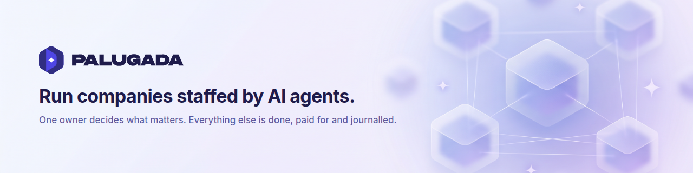
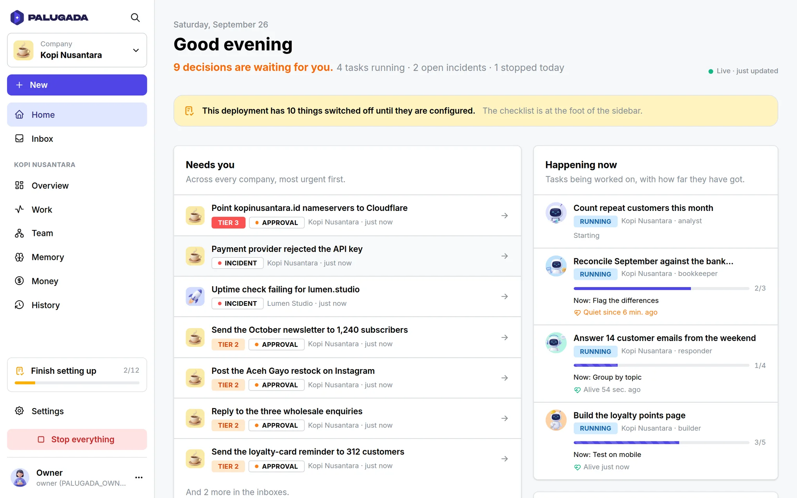
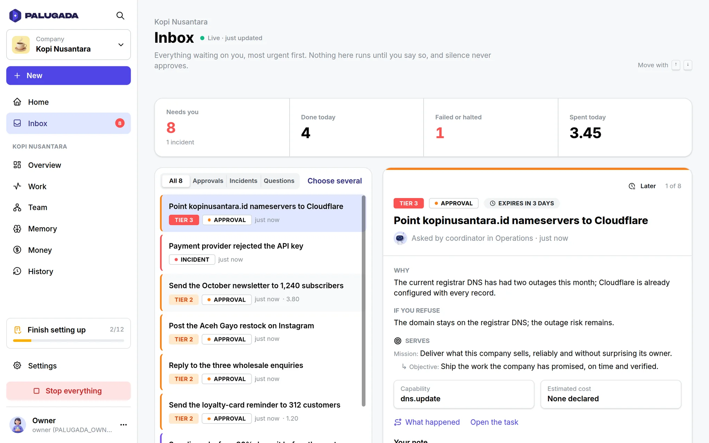
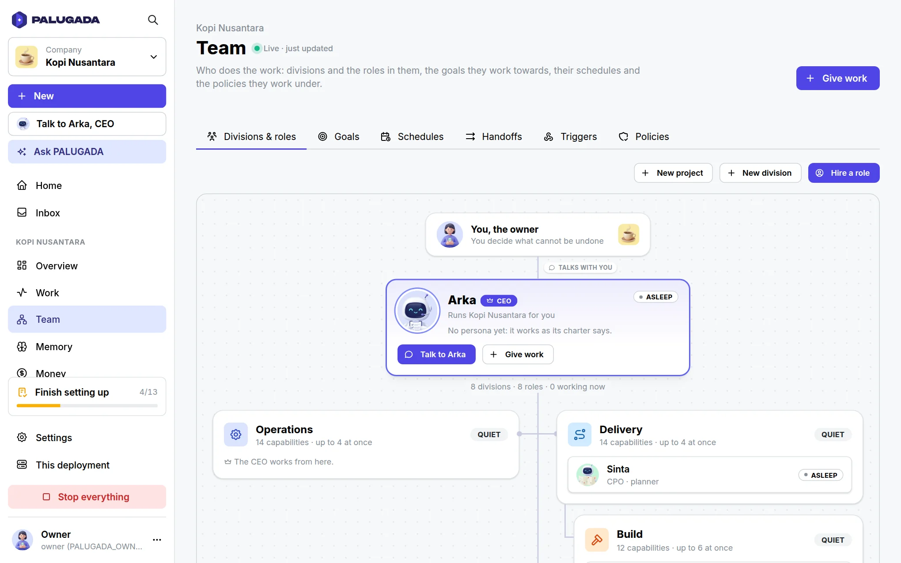
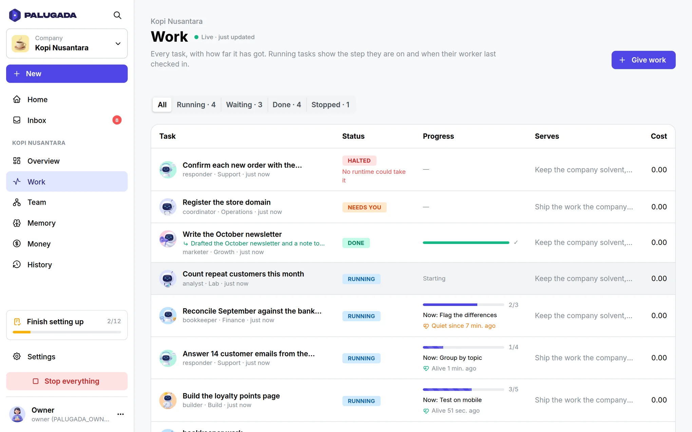
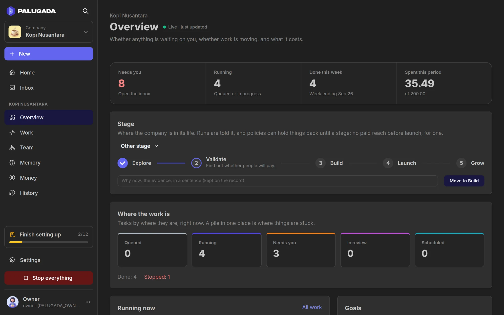

<p align="center">
  <picture>
    <source media="(prefers-color-scheme: dark)" srcset="brand/banners/palugada-banner-dark.png">
    
  </picture>
</p>

<h3 align="center">Run companies staffed by AI agents.<br>Decide only what cannot be undone.</h3>

<p align="center">
  <a href="#quickstart"><b>Quickstart</b></a> ·
  <a href="#how-it-works"><b>How it works</b></a> ·
  <a href="docs/features.md"><b>All features</b></a> ·
  <a href="docs/configuration.md"><b>Configuration</b></a> ·
  <a href="docs/STATUS.md"><b>Status</b></a> ·
  <a href="CONTRIBUTING.md"><b>Contributing</b></a>
</p>

<p align="center">
  <a href="https://github.com/TegarTheGreat/PALUGADA/actions/workflows/ci.yml"></a>
  
  
  
  
</p>

<p align="center">
  
</p>

**PALUGADA** is a self-hosted control plane for companies run by AI agents.
Agents plan, build, market, answer customers and keep the books. You own the
company, and your whole job is one inbox of decisions -- in the console, a push
notification or a Telegram button. Nothing irreversible happens until you say
so, and money is reserved before any work starts.

If an agent CLI is an employee, PALUGADA is the company around it: the org
chart, the budget, the rulebook, the memory and the owner's desk. One
installation runs as many companies as you like, each isolated in the
database.

> *Palugada* is Jakarta slang: *apa lu mau, gua ada* -- whatever you need,
> it's here.

## How it works

<table>
  <tr>
    <td width="33%" valign="top">
      <h3>1. Start a company</h3>
      From the standard template: eight divisions by function -- operations,
      delivery, build, growth, finance, support, assurance, a lab -- a role in
      each with a charter and done criteria, a budget for every division and a
      goal ladder. Tick <i>Let it run itself</i> and a strategist reviews the
      week every Monday.
    </td>
    <td width="33%" valign="top">
      <h3>2. Give it work</h3>
      Tell the coordinator what you want. It hands the work to the role whose
      job it is. With a model, the platform runs that role itself; or put
      the role on Claude Code, another agent CLI you describe in one entry, an
      HTTP service or Docker with no network. Every action goes through a
      broker that knows its cost and how hard it is to undo.
    </td>
    <td width="33%" valign="top">
      <h3>3. Decide what matters</h3>
      Reading and undoable work simply happens. Spending needs a recorded plan
      and budget. Anything irreversible waits for you, with a second factor.
      A request you never answer cancels itself, so silence never executes
      anything.
    </td>
  </tr>
</table>

| Tier | Effect | For example | What happens |
|---|---|---|---|
| 0 | Reads | a DNS lookup, an uptime check | Runs |
| 1 | Cheap to undo | a draft, a staging deploy | Runs, then is read back to verify it |
| 2 | Costs money or reaches people | an email to a customer, an invoice paid | Needs a plan and a budget check first, verified after |
| 3 | Irreversible | nameservers, deletions, transfers, signatures | Waits for you, in the app, with a second factor |

No template, policy or agent can move a tier 3 action out of your hands.

## Quickstart

**With Docker** (any machine with Docker Compose and Node 22.18+ for the setup):

```sh
git clone https://github.com/TegarTheGreat/PALUGADA.git && cd PALUGADA
npm install
npm run setup                  # choose "With Docker Compose"
docker compose up -d --build
```

**On this machine** (Node 22.18+ and PostgreSQL 16 with
[pgvector](https://github.com/pgvector/pgvector)):

```sh
git clone https://github.com/TegarTheGreat/PALUGADA.git && cd PALUGADA
npm install && npm run console:install
npm run setup                  # choose "On this machine"
npm run db:setup && npm run db:migrate   # once; pgvector needs a Postgres superuser
npm run console:build
npm start
```

`npm run setup` asks three things and writes them to `.env`: where PALUGADA
runs, your authenticator (it shows a QR code and checks a code from your
phone), and which model does the work. Any model that calls tools will do --
Anthropic, OpenAI, OpenRouter, Gemini, DeepSeek, Groq, or Ollama and vLLM on
your own machine -- and setup sends it one request to prove the key, the
address and that it calls tools. Then open **http://127.0.0.1:8787**, sign in
with the six-digit code, and press **Start a company**.

New here? [The guide](docs/guide/README.md) walks through the first company,
what each screen is for, and how to run it for real at each size -- a few
companies or many, always with one owner.
Every setting is in [docs/configuration.md](docs/configuration.md).

## What you get

<table>
  <tr>
    <td width="33%" valign="top"><b>📥 One inbox</b><br>Every decision from every company in one queue, with the goal it serves, what it costs, how reversible it is and what happens if you say no.</td>
    <td width="33%" valign="top"><b>🔐 The irreversible waits for you</b><br>A second factor for tier 3, approvals that expire into a cancellation, and one approval for exactly one action.</td>
    <td width="33%" valign="top"><b>💸 Money cannot run away</b><br>Reserved before work starts, a ceiling per task and per month, a warning at 80%, a pause at 100% and a breaker on the burn rate.</td>
  </tr>
  <tr>
    <td valign="top"><b>🏢 An organisation that moves</b><br>A coordinator routes work, a planner hands the build to the builder, and a stuck division asks the coordinator before it asks you.</td>
    <td valign="top"><b>🤖 Any model, or your agent</b><br>A role runs on the platform's own loop with any model -- Anthropic or any OpenAI-compatible API, local ones included -- or on Claude Code and other agent CLIs. None sees a credential or the database, and each gets only the tools it was granted.</td>
    <td valign="top"><b>♻️ A crash loses little</b><br>Every step is journalled and a run resumes at the step it reached. Leases stop a task running twice, and a task that keeps killing its worker is halted.</td>
  </tr>
  <tr>
    <td valign="top"><b>🛡️ Isolation in the database</b><br>Row-level security forced on every tenant table: a row cannot even point into another company.</td>
    <td valign="top"><b>🧠 A company that learns</b><br>Versioned facts found by what they say, procedures distilled from experience once a model is set, skills with eval cases, and your word first in every run.</td>
    <td valign="top"><b>🌏 In your language</b><br>The console in English and Indonesian, and each company chooses what its agents write in.</td>
  </tr>
</table>

Everything else -- goals measured by numbers, stage gates, schedules, signed
webhooks, bundles, audit export -- is in [docs/features.md](docs/features.md).

<table>
  <tr>
    <td width="50%"></td>
    <td width="50%"></td>
  </tr>
  <tr>
    <td></td>
    <td></td>
  </tr>
</table>

## What PALUGADA is not

| | |
|---|---|
| **Not a chat workspace** | You do not manage agents in threads. You answer decisions, and they stay searchable. |
| **Not an agent framework** | It does not build agents. It runs a company of them, whichever ones you bring. |
| **Not a workflow builder** | Work is goals, roles and tasks with contracts, not boxes and arrows. |
| **Not an autopilot without brakes** | What cannot be undone always waits for a person. That is the design, not a setting. |

## How it compares

PALUGADA was read against four systems people use to run agents at work,
looking for what goes wrong in each and whether it goes wrong here -- and
for what they do that it does not.

| | Chat workspaces (Slack, Buzz) | auto-company | Paperclip | **PALUGADA** |
|---|---|---|---|---|
| **An irreversible action** | Buzz approves every tool permission itself | "Do not wait for human approval" | Decisions expire after a week; no second factor | The owner, with a second factor; unanswered means cancelled |
| **Isolation between companies** | Buzz: row-level security specified, not shipped | — | Application code only | Forced row-level security, company-scoped foreign keys |
| **A spending ceiling** | — | — | Checked after the money is spent, so the call that crosses it runs | Reserved before the work starts, and each capability's estimate charged before it runs; one call costing more than its estimate can still pass it |
| **Usage an agent did not price** | — | Paused as "unverifiable" | Recorded at 0¢, so the hard stop never trips | Priced from the operator's list or a high fallback |
| **Agents triggering agents** | Buzz: no hop limit | — | A re-wake throttle, no hop limit | Hop limit and cycle detection |
| **Past decisions** | Lost as threads scroll | A file the model rewrites each cycle | Kept with the decider's note | Kept with the outcome and your note, and searchable |
| **Integrations** | Slack: a large app directory | — | A governed MCP gateway | Built-ins, vendor files, MCP servers signed in with OAuth, and Composio, Pipedream, Arcade, Smithery and Zapier by name; every tool still at a tier |
| **Watching it run** | — | — | Tracing | JSON logs, a health check, Prometheus metrics and OpenTelemetry traces |
| **Installing** | Slack: nothing, it is hosted; Buzz: a container image | A script | A container image | `npm run setup`, then Docker Compose or Node and Postgres; Linux only |
| **People** | Many | One | Many | One owner, by design |

The ceiling row is cited to Paperclip's `server/src/services/budgets.ts`
in [docs/COMPETITIVE-ANALYSIS-2026-09-30.md](docs/COMPETITIVE-ANALYSIS-2026-09-30.md),
which also found the same among newer projects: AgenticOS says in its own
documentation that runs going at once can pass its ceiling, and OtoDock
checks spending already recorded with nothing reserved. The next five rows
are cited to source code or public documentation in
[docs/RESEARCH-2026-09.md](docs/RESEARCH-2026-09.md); the last four, and the
corrections to the Paperclip column, come from the audit recorded in
[docs/STATUS.md](docs/STATUS.md) section 2.21, brought up to date as the
integrations and observability were built.

## Architecture

```
             owner  ── console · push · Telegram ──►  decisions inbox
                                                           │
  ┌─────────────────────────────── PALUGADA ───────────────┼──────────────┐
  │  companies → divisions → roles → tasks           approvals, incidents │
  │                                                                       │
  │  durable engine ─► capability broker ─► tiers · policies · budgets    │
  │        │                  │                                           │
  │   journal, leases     read-back, plans, review, audit log             │
  └────────┼──────────────────┼───────────────────────────────────────────┘
           ▼                  ▼
   agent runtimes        the outside world
   (Claude Code, CLIs,   (email, DNS, invoices, deploys …)
    HTTP, Docker, sandbox)
```

TypeScript on Node 22 with no build step for the server, PostgreSQL 16 with
pgvector, and a React and [Mantine](https://mantine.dev) console served from
the same origin under a strict content security policy. The engine never
calls a model itself: a runtime does -- the platform's own in-process loop,
or an agent you bring -- and the engine lends it tool calls through the
broker, journalled steps, contained sub-tasks and a way to report cost.

## Limits worth knowing

- **Vendor integrations are verified up to the wire.** Push, Telegram, the
  model API, MCP servers and the agent CLIs are exercised end to end against
  local servers, not against the vendors themselves.
- **Agent CLIs change their flags between releases.** Claude Code 2.1.283,
  Codex 0.157.1, Gemini CLI 0.61.0 and OpenCode 1.18.32 were run with the
  shipped entries against a stand-in model; Hermes (v2026.9.24 or later, from
  its repository) and OpenClaw 2026.9.6 were read from their source. A newer
  release that moves a flag is corrected in `PALUGADA_RUNTIME_SPECS`, without
  a code change.
- **The only network isolation is the Docker runtime** (`--network none`).
  Code-executing capabilities never get a credential either way.
- **Integrations are what you bind.** The built-ins, vendor files and the MCP
  servers you allow-list. There is no connector catalogue and no OAuth flow
  for connecting an account.
- **One owner, on Linux.** There are no other users, no single sign-on and
  no roles for staff. Run directly it is tested on Linux only; on macOS or
  Windows, run the container with Docker Desktop. The container image runs
  no agent CLI of its own; one is added by extending it.
- **Companies are frozen, exported or retained, never deleted.** The event log
  is append-only by design.
- **A capability that needs somebody's account waits for one.** Sending
  email, paying invoices or changing DNS is bound by a vendor file you
  provide; until then the role is told it needs a vendor.

## Documentation

- [docs/guide/](docs/guide/README.md): the owner's guide -- a first hour, the concepts, how to do each thing, running it, scale, and what to do when something is wrong.
- [docs/features.md](docs/features.md): the guarantees and everything that is built.
- [docs/configuration.md](docs/configuration.md): installing, production and every setting.
- [docs/STATUS.md](docs/STATUS.md): every requirement graded, with the defects found and fixed.
- [CHANGELOG.md](CHANGELOG.md): what each version changed, for an owner or an operator.
- [docs/THREAT-MODEL.md](docs/THREAT-MODEL.md): who can attack a deployment, what stops each in order, the test for each defence, and what is left.
- [docs/PRD.md](docs/PRD.md): the specification (v2, in Indonesian); `F5.4` in the code refers to it.
- [docs/RESEARCH-2026-09.md](docs/RESEARCH-2026-09.md): the comparison with Slack, Buzz, auto-company and Paperclip.
- [docs/AUDIT-2026-09-28.md](docs/AUDIT-2026-09-28.md): an outside audit's thirty-one items, each verified, and what was fixed or proposed.
- [docs/COMPETITIVE-ANALYSIS-2026-09-28.md](docs/COMPETITIVE-ANALYSIS-2026-09-28.md): how mature it is, from the suite, a live run on a real model and a code audit, against Paperclip, Buzz, Auto-Company and the wider market (in Indonesian, like the PRD).
- [brand/](brand/README.md): the logo, the banners and the console's pictures.

## Contributing

[CONTRIBUTING.md](CONTRIBUTING.md) is for people and [AGENTS.md](AGENTS.md)
for coding agents; both describe the same loop: find the requirement, write
the failing test, change the code, run `npm run check`. PALUGADA can take a
task about its own code too: the built-in `palugada-dev` bundle adds a
platform engineer and a read-only reviewer, and nothing merges without you.

## Security

Please report a vulnerability privately through GitHub's
**Report a vulnerability** on this repository rather than in an issue.

## License

PALUGADA does not carry a license yet. Until the owner chooses one, the code
is visible here but not licensed for reuse.
